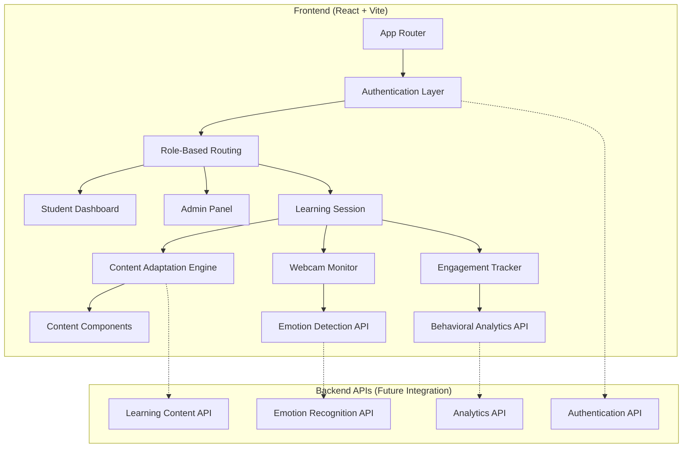

# Design Document

## Overview

The Neuroadaptive Learning AI Frontend is a React-based single-page application built with Vite that provides an adaptive learning platform. The system uses a modular component architecture with real-time state management to deliver personalized learning experiences. The application integrates webcam monitoring, behavioral tracking, and content adaptation algorithms to create a responsive educational environment.

The frontend is designed to be backend-agnostic with clear API integration points for Flask/FastAPI services. The architecture emphasizes modularity, scalability, and maintainability while providing a smooth user experience across different devices.

## Architecture

### High-Level Architecture



### Technology Stack

- **Framework**: React 18 with TypeScript
- **Build Tool**: Vite
- **State Management**: React Context API + useReducer for complex state
- **Routing**: React Router v6
- **UI Components**: Custom components with CSS Modules
- **Charts**: Chart.js with react-chartjs-2
- **Webcam**: react-webcam
- **HTTP Client**: Axios for API integration
- **Form Handling**: React Hook Form
- **Styling**: CSS Modules with SCSS
- **Testing**: Vitest + React Testing Library

### Folder Structure

```
frontend/
├── src/
│   ├── components/
│   │   ├── common/
│   │   ├── auth/
│   │   ├── dashboard/
│   │   ├── learning/
│   │   ├── monitoring/
│   │   └── admin/
│   ├── hooks/
│   ├── contexts/
│   ├── services/
│   ├── utils/
│   ├── types/
│   └── styles/
├── public/
└── tests/
```

## Components and Interfaces

### Core Context Providers

#### AuthContext
```typescript
interface AuthContextType {
  user: User | null;
  login: (credentials: LoginCredentials) => Promise<void>;
  logout: () => void;
  register: (userData: RegisterData) => Promise<void>;
  isLoading: boolean;
}
```

#### LearningSessionContext
```typescript
interface LearningSessionContextType {
  currentSession: LearningSession | null;
  engagementLevel: EngagementLevel;
  contentType: ContentType;
  adaptContent: (trigger: AdaptationTrigger) => void;
  sessionMetrics: SessionMetrics;
}
```

#### EngagementContext
```typescript
interface EngagementContextType {
  webcamEnabled: boolean;
  emotionState: EmotionState;
  behaviorMetrics: BehaviorMetrics;
  toggleWebcam: () => void;
  updateEngagement: (level: EngagementLevel) => void;
}
```

### Component Architecture

#### Authentication Components
- `LoginForm`: Form validation with error handling
- `RegisterForm`: Multi-step registration with role selection
- `ProtectedRoute`: Role-based route protection
- `AuthLayout`: Shared layout for auth pages

#### Dashboard Components
- `StudentDashboard`: Main dashboard with metrics overview
- `WelcomeCard`: Personalized greeting component
- `SessionOverview`: Real-time session state display
- `EngagementChart`: Chart.js integration for metrics visualization
- `QuickStats`: Performance indicators component

#### Learning Session Components
- `LearningInterface`: Main learning session container
- `ContentRenderer`: Dynamic content type switching
- `EngagementControls`: Manual engagement level controls
- `AdaptationIndicator`: Visual feedback for content changes
- `SessionProgress`: Progress tracking component

#### Monitoring Components
- `WebcamMonitor`: react-webcam integration with controls
- `EmotionPlaceholder`: API-ready emotion detection display
- `BehaviorTracker`: Mouse, scroll, and typing activity tracker
- `EngagementMeter`: Real-time engagement visualization

#### Content Components
- `TextContent`: Rich text display with reading analytics
- `VideoContent`: Video player with engagement tracking
- `QuizContent`: Interactive quiz with immediate feedback
- `InfographicContent`: Visual content with interaction points

#### Reporting Components
- `ReportingDashboard`: Main analytics interface
- `AttentionTrendChart`: Time-series attention data
- `EmotionTimeline`: Session emotion progression
- `ExportControls`: PDF/CSV export functionality
- `SessionComparison`: Multi-session analysis

#### Profile Components
- `UserProfile`: Profile management interface
- `LearningPreferences`: Style and preference settings
- `SessionHistory`: Historical session data display
- `GoalsTracker`: Learning goals and streak tracking

#### Admin Components
- `AdminDashboard`: Administrative overview
- `UserManagement`: User list and management tools
- `EngagementComparison`: Cross-user analytics
- `SystemControls`: Backend integration controls

## Data Models

### User Models
```typescript
interface User {
  id: string;
  name: string;
  email: string;
  role: 'student' | 'admin';
  preferences: LearningPreferences;
  createdAt: Date;
}

interface LearningPreferences {
  preferredContentType: ContentType;
  difficultyLevel: 'beginner' | 'intermediate' | 'advanced';
  sessionDuration: number;
  adaptationSensitivity: 'low' | 'medium' | 'high';
}
```

### Learning Session Models
```typescript
interface LearningSession {
  id: string;
  userId: string;
  startTime: Date;
  endTime?: Date;
  contentItems: ContentItem[];
  engagementHistory: EngagementPoint[];
  adaptations: ContentAdaptation[];
  finalMetrics: SessionMetrics;
}

interface ContentItem {
  id: string;
  type: ContentType;
  title: string;
  content: string | VideoData | QuizData;
  duration: number;
  engagementScore: number;
}

type ContentType = 'text' | 'video' | 'quiz' | 'infographic';
```

### Engagement Models
```typescript
interface EngagementPoint {
  timestamp: Date;
  level: EngagementLevel;
  emotionState: EmotionState;
  behaviorMetrics: BehaviorMetrics;
  contentContext: ContentContext;
}

interface BehaviorMetrics {
  mouseActivity: number;
  scrollSpeed: number;
  typingActivity: number;
  focusTime: number;
  clickFrequency: number;
}

interface EmotionState {
  primary: 'focused' | 'confused' | 'bored' | 'engaged' | 'frustrated';
  confidence: number;
  timestamp: Date;
}

type EngagementLevel = 'high' | 'medium' | 'low';
```

### Analytics Models
```typescript
interface SessionMetrics {
  totalDuration: number;
  averageEngagement: number;
  contentCompletionRate: number;
  adaptationCount: number;
  emotionDistribution: Record<string, number>;
  performanceScore: number;
}

interface ReportData {
  sessionId: string;
  userId: string;
  metrics: SessionMetrics;
  engagementTrend: EngagementPoint[];
  contentEffectiveness: ContentEffectiveness[];
}
```

## Error Handling

### Error Boundary Strategy
- Global error boundary for unhandled exceptions
- Component-level error boundaries for isolated failures
- Graceful degradation for non-critical features
- User-friendly error messages with recovery options

### API Error Handling
```typescript
interface APIError {
  code: string;
  message: string;
  details?: any;
  timestamp: Date;
}

// Error handling patterns
const handleAPIError = (error: APIError) => {
  switch (error.code) {
    case 'AUTH_EXPIRED':
      // Redirect to login
      break;
    case 'WEBCAM_PERMISSION_DENIED':
      // Fallback to manual engagement controls
      break;
    case 'CONTENT_LOAD_FAILED':
      // Show cached content or alternative
      break;
    default:
      // Generic error handling
  }
};
```

### Offline Handling
- Service worker for offline capability
- Local storage for session continuity
- Queue API requests when offline
- Sync data when connection restored

## Testing Strategy

### Unit Testing
- Component testing with React Testing Library
- Hook testing with custom test utilities
- Utility function testing with Vitest
- Mock API responses for isolated testing

### Integration Testing
- User flow testing across components
- Context provider integration testing
- API integration testing with mock servers
- Cross-browser compatibility testing

### E2E Testing
- Critical user journeys (login, learning session, adaptation)
- Webcam permission and functionality testing
- Content adaptation flow testing
- Admin panel functionality testing

### Performance Testing
- Component render performance
- Memory usage monitoring
- Bundle size optimization
- Real-time update performance

### Accessibility Testing
- Screen reader compatibility
- Keyboard navigation testing
- Color contrast validation
- ARIA label verification

## Real-Time Features Implementation

### WebSocket Integration (Future)
```typescript
interface WebSocketManager {
  connect: () => void;
  disconnect: () => void;
  sendEngagementData: (data: EngagementPoint) => void;
  onContentAdaptation: (callback: (adaptation: ContentAdaptation) => void) => void;
}
```

### State Synchronization
- Real-time engagement level updates
- Live content adaptation triggers
- Session metrics streaming
- Multi-device session continuity

## Security Considerations

### Authentication Security
- JWT token management with refresh tokens
- Secure storage of authentication data
- Role-based access control implementation
- Session timeout handling

### Privacy Protection
- Webcam data encryption in transit
- Local processing of sensitive data where possible
- User consent management for data collection
- GDPR compliance considerations

### Data Protection
- Input sanitization for all user data
- XSS prevention in dynamic content
- CSRF protection for API calls
- Secure API endpoint integration

## Performance Optimization

### Code Splitting
- Route-based code splitting
- Component lazy loading
- Dynamic imports for heavy libraries
- Webpack bundle optimization

### Caching Strategy
- API response caching
- Static asset caching
- Component memoization
- Local storage optimization

### Real-Time Optimization
- Debounced engagement tracking
- Efficient WebRTC handling for webcam
- Optimized chart rendering
- Memory leak prevention

## Backend Integration Points

### API Endpoints (Ready for Integration)
```typescript
// Authentication API
POST /api/auth/login
POST /api/auth/register
POST /api/auth/refresh
DELETE /api/auth/logout

// Learning Content API
GET /api/content/session/:sessionId
POST /api/content/adapt
GET /api/content/recommendations/:userId

// Emotion Recognition API
POST /api/emotion/analyze
GET /api/emotion/session/:sessionId

// Analytics API
POST /api/analytics/engagement
GET /api/analytics/reports/:userId
GET /api/analytics/session/:sessionId
```

### Data Synchronization
- Real-time engagement data streaming
- Batch processing for analytics
- Offline data queue management
- Conflict resolution strategies

This design provides a comprehensive foundation for the Neuroadaptive Learning AI Frontend, with clear separation of concerns, scalable architecture, and ready integration points for backend services. The modular approach ensures maintainability while the real-time features enable the adaptive learning experience.